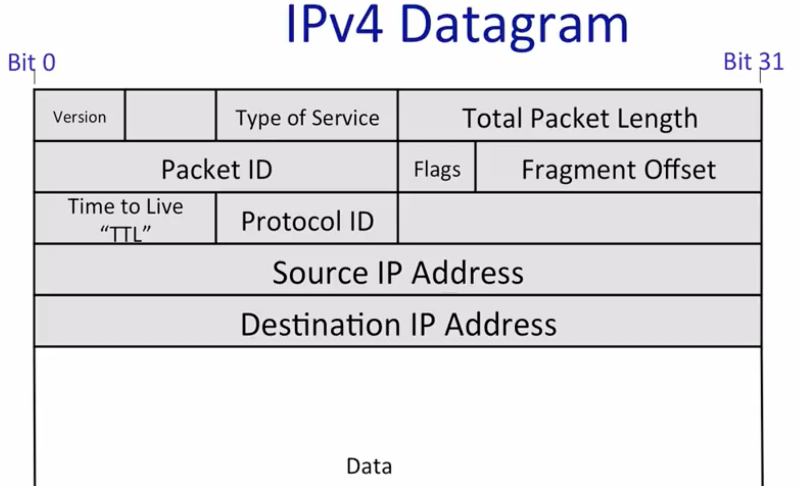
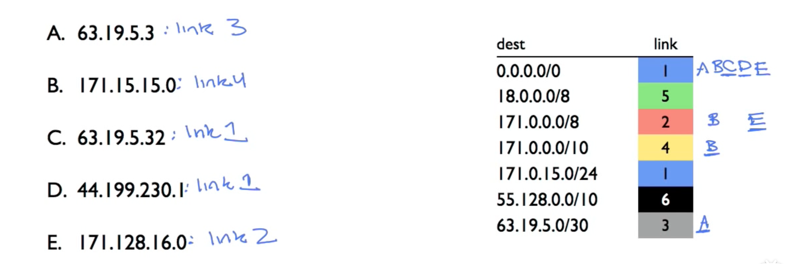
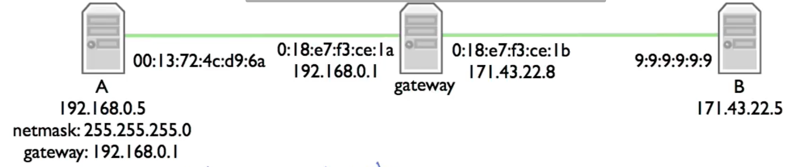
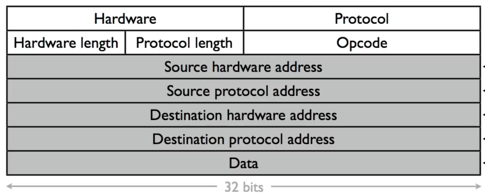

## 1.2 四层结构
* 从上到下，应用层，传输， 网络， 链路

## 1.3 ip服务
* 四个属性
    * 数据报：独立的路由包，逐个跳转路由
    * 不可靠：包可能会被丢弃
    * 最大努力：尽最大努力投递，但仅在需要时
    * 无连接：无状态，包可能是非序列的

* 防止包无限循环
* 如果包过长会分裂包
* 使用头的checksum降低投递到错误重点的机会
* ipv4和ipv6两种协议
* 允许新的选项被添加到头中
* ipv4数据报
    * 

## 1.4 包的生命周期
* 三次握手
    * 客户端发送请求到服务器，称为syn
    * 服务器返回相应，称为syn/ack
    * 客户端再次发送确认请求到服务器，称为ack

* 路由规则
    * 路由器根据自己拥有的路由表，与目的地的ip的前缀最大匹配方法进行转发
    * 追踪路由的指令：traceroute

* wireshark观察tcp流，构建和交换数据的工具

## 1-5 分组交换原则 （packet switching）
* 数据包：一个为了投递到终点的携带了必要信息的自包含的数据单元
* 分组交换原理 （packet switching）独立于每个到达的数据包，选择其传出链路。如果链路是free（自由？）则将其发送

* 两个结果
    * 简化数据包转发
        * 不需要每个流的状态
            * 
    * 提高链路分享的效率

## 1-6 分层原则 layering principle
* 分层 - 四层模型
    * 通过分层，使得每个层通过向上提供接口，隐藏掉具体的实现细节的方式使其能够专注于该层的实现，无需关心其他层的内容。
* 分层的好处
    * 模块化
    * 定义清晰的服务
    * 重用
    * 分离关注点
    * 持续的改进
    * 点到点通信

## 1-7 封装原则
* 在4层模型中，下层的的有效载荷部分由上层的头和数据组层，传输层的有效载荷包含为，应用层的头和应用层的数据部分。以此类推。
* vpn的结构如下
    * 应用层的有效载荷
    * TCP传输层的节
    * IP网络层的包
    * 加了密的TLS消息
    * TCP传输层节
    * IP网络层包
    * 以太网连接桢

## 1-8 字节顺序
* 大端表示于小端表示
    * 小端表示法：低位的数据在低位地址中。1024的16进制表示为 0x0400， 内存中一个地址表示一个字节，因此可讲数据分为04｜00分别存储在两个地址中。 在内存中存储的顺序为00｜04 。
    * 大端表示法： 与小端刚好相反，在内存中为00｜04。

* 网络的字节顺序为大端表示。

* help function： htons ， ntohs， htonl， ntohl
    * h代表主机， n代表网络， s 是short l 是long
    * <arpa/inet.h>头中

## 1-9 ipv4地址
* ip地址是网络中的设备的识别符
* 32位点分的数字
* 网络掩码：与掩码做与运算后，如果匹配则为在相同的网络

* 地址结构
    * CIDR （classless inter-domain routing）
        * 地址块是一对：地址/计数 
        * 171.64.0.0/16 ： 地址范围为171.64.0.0-171.64.255.255

## 1-10 LPM 最长前缀匹配
* 路由表的构成
    * 0.0.0.0/0       1  default  匹配任意ip地址
    * 171.33.0.0/16   2  
    * 23.0.0.0/8      3

* 上述表中如果存在与dest的ip地址匹配程度最大则转发到该链路中。
    * 此处的匹配程度是指在与CIDR指定的部分完全匹配的前提下，匹配的长度最大的那条记录。
    * 

## 1-11 ARP 地址解析协议
* 链路层的地址有6个8位的数字组成，是网卡的地址。
* 网关具有可以有多个ip地址与多个网卡。 gateway
    * 
    * 客户端A想要发送数据到171...的终点ip中，客户端A与掩码运算后发现终点的IP不属于同一个网络，于是将数据发送到网关。
    * 发送的数据格式如下
        * 源ip： 192.168.0.5
        * 源mac地址： 00:13:72:4c:d9:6a
        * 终点ip： 171.43.22.8
        * 终点mac地址： 0:18:e7:f3:ce:1a (网关的mac地址)
    * 发送到网关后,网关将ip数据包作为有效载荷并将修改链路层的终点mac地址位171对应的mac地址，并将其发送

* ARP协议
    * 该协议的目的是找到与ip地址对应关系的mac地址
    * 步骤
        * 向同一个网络内的节点以广播的形式发送请求，谁知道某ip地址的mac地址。
        * 收到请求的节点会更新发送源的ip与mac的映射关系的缓存，缓存具有持续时间
        * 知道对应关系的节点，会以单播的形式发送回应数据请求源。
    * 数据结构
        * 