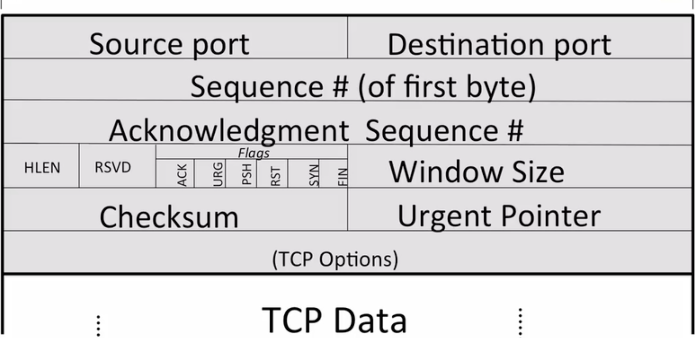
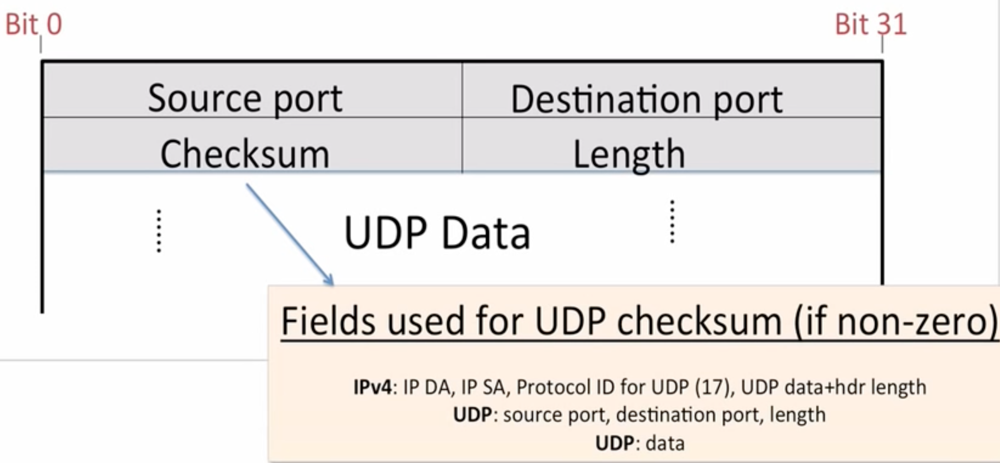
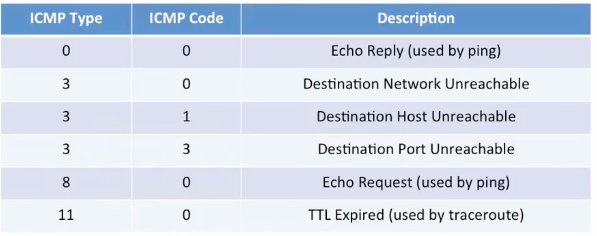
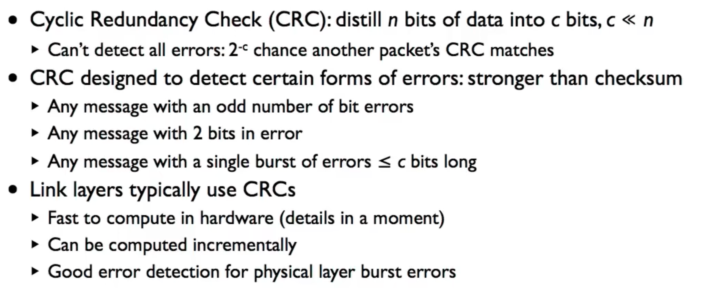
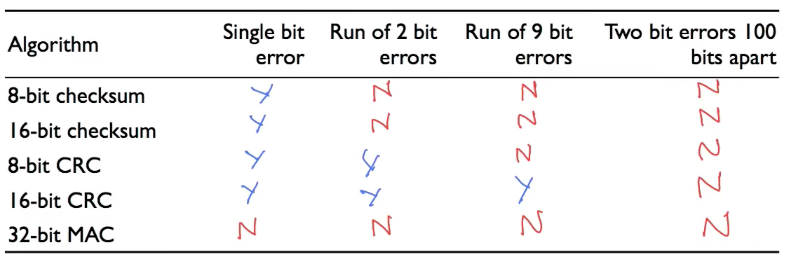
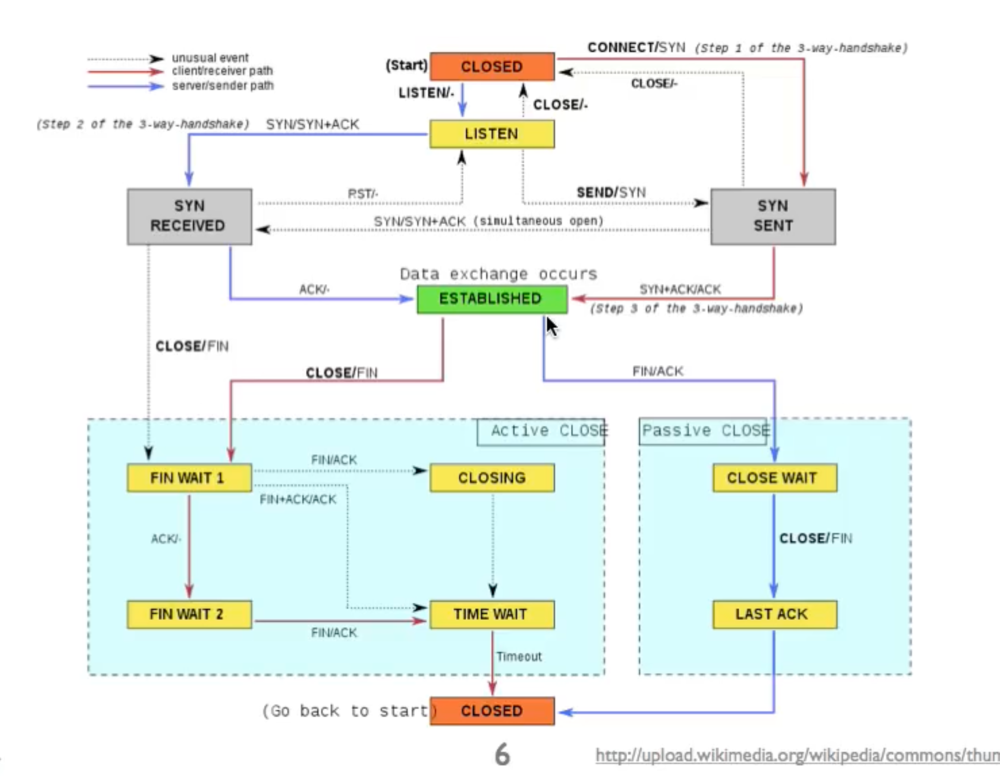
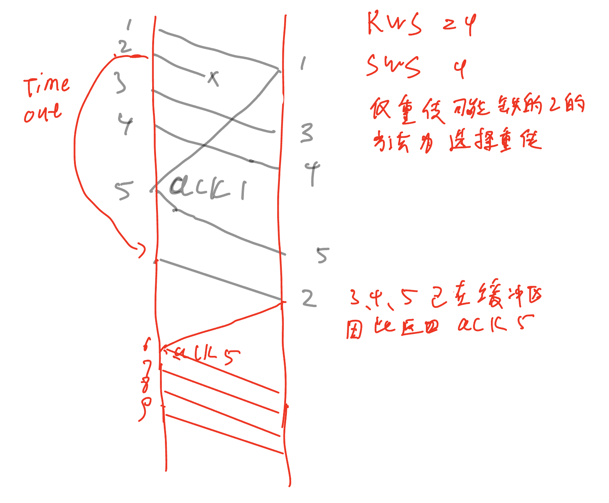
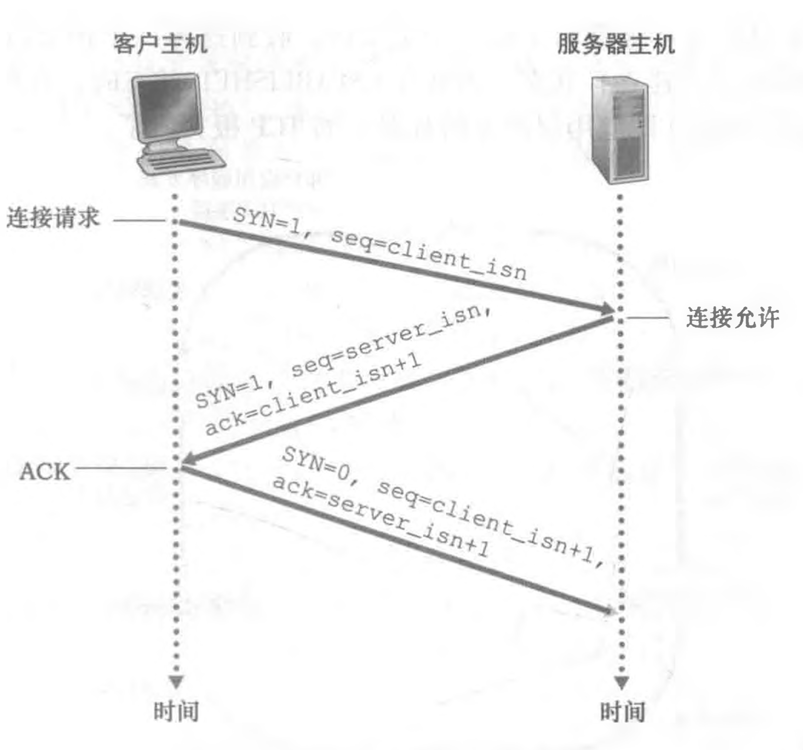
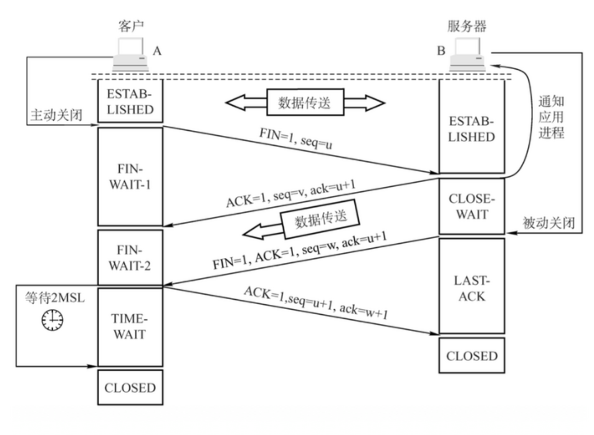

# 章节2 传输层
## 2-1 TCP 服务模型
* 三次握手 
    * 主机A与主机B通过三次握手建立TCP连接
    * A向B 发送syn消息，希望建立连接 
    * B向A 发送syn+ack消息
    * 最后A响应一个ack。

* 四次挥手
    * 主机A与B关闭TCP连接
    * A向B发送Fin消息， 要求关闭连接
    * B向A发送Ack消息，此时还会携带数据。
    * B想A发送Fin消息，可以关闭连接
    * A向B发送Ack消息，关闭连接

* TCP的特性
    * 字节流：可靠的字节递送服务
    * 可靠投递
        * Ackowledgment指示正确的投递
        * Checksum检测数据是否被破坏
        * Sequence检测缺失数据
        * Flow-control防止接收器过载
    * 顺序串联（in-sequence）：数据投递是顺序地传输到应用
    * 拥堵控制： 控制网络拥堵
    
* TCP头
    * 

## 2-2 UDP
* UDP头结构
    * 

* UDP属性
    * 无连接：不会建立连接
    * 数据报服务：包可能会是以任意顺序
    * 自包含的数据报
    * 不可靠投递
        * 没有 acknowledgements
        * 没有检测丢失或丢失序列的数据报机制
        * 没有流控制

## 2-3 ICMP服务模型 网络控制信息模型
* 作用
    * 交流源与终点（或路由）的网络层信息
    * 报告错误的状态
    * 帮助诊断问题
* ICMP是传输层的协议
* 属性
    * 报告信息：自包含的消息报告错误
    * 不可靠：简单的数据报服务-没有重试

* 参考RFC792查看icmp支持的错误类型
    * 

* 应用
    * ping： 给终点发送echo reply的ICMP消息，当终点主机收到消息后会发响应的icmp消息到源主机
    * traceroute： 给终点主机发送udp的消息，且第一次发送的TTL位1 此时路由器收到消息并对TTL减1处理。当TTL为零时向源主机发送TTL过期的ICMP消息，第二次发送时TTL设为2 以此类推一直发送消息。直到收到端口不可达的的消息为止。
    
## 2-4 端到端原则
* 端到端原则认为在网络通信中，只应该有最基本的、必要的功能放在网络层次的中间节点上，而将更复杂的、更高级别的功能交给端点完成。例如，在传输数据时，网络中间节点只需要将数据按照目标地址进行转发即可，而数据的完整性、可靠性、安全性等则应该由端点负责实现和验证。

* 端到端原则的目的是在保持网络的简单性和灵活性的同时，确保系统的可靠性、安全性和高效性。通过将更复杂的功能下放到端点，可以减少中间节点的负担，降低系统的复杂度，同时也可以使得端点更加灵活地应对各种情况，提高系统的可靠性和效率

## 2-5 错误检测：3个方案
* Checksum， CRC， MAC
* CheckSum
    * CheckSum将其值放在IP或TCP的包中，udp包中
        * 快速，便宜
        * 鲁棒性差
    * 算法
        * 对与包中设置checksum属性16位的值全部为0
        * 计算checksum的数据按2byte划分开来，每2byte组成一个16bit的值，如果最后有单个byte的数据，补一个byte的0组成2byte；
        * 将所有16位值累加到32位中
        * 将32位值得高16位与低16位相加到32位值中，若32位值大于0xffff，再将高16位与低16位相加
        * 将相加后的16位值按位去翻，得到checksum存入该字段中。
* CRC （循环冗余校验）
    * CRC计算多项式的余数
        * 计算相比checksum更昂贵
        * 能检测任意2位错误，任意突发小于c位，任意奇数
    * 在链路层上执行CRC校验
    * 
    * 算法
        * 基本思路位将n位数据中经过多项式模运算后写入c位中，在终点主机做作同样的运算后得到余数为0则代表没有错误

        * 首先选择多项式，G（X） = X4 + X3 + 1  将多项式转换为二进制则变为11001  
        * 将消息的后面加上4位0（多项式的最高位）后与多项式进行取模运算后，写入到消息中。
        * 在终点主机上再次使用相同多项式执行取模处理 ，得到值如果为0说明无措

* MAC（信息验证码）：加密传输的数据
    * 对恶意修改有较强的检测能力，不是错误
    * 任意两个信息有2-c的机会具有相同的码
    * 使用加密算法输入消息与密钥，生成码，在终点主机进行运算后验证值是否相同
    
* 错误检测示例
    * 

## 2-6 有限状态机
* 具有有限的状态和事件（事件引发状态的改变）
* tcp的状态图
    * 

## 2-7 流控制 stop-and-wait
* 基本思路是发送一个消息，等待确认消息，在发送下一个消息。如果超时则重发。
* 实现简单，性能很差

## 2-8 流控制 滑动窗口
* 一次发送和接收多个包，使其能够提高效率
* 发送方
    * 每个节具有序列号SeqNo
    * 维护三个变量
        * 发送的窗口大小 SWS
        * 最后接收的承认序列号 LAR
        * 最后发送的节 LSS
    * 需要保证的不变量 （LSS- LAR）<= SWS   
        * 最后发送的节减去最后接收的承认序列号，要小于等于窗口
    * Advance LAR on new acknowlegement
    * 缓冲到SWS节

* 接收方
    * 三个变量
        * 接收窗口大小 RWS
        * 最后可接受节 LAS
        * 最后接收的节 LSR
    * 需要保证的不变量 LAS-LSR<= RWS
    * tcp的ACK是发送积累后的值，比如 1 2 3 5 收到 则发送4 （意味下一个需要得到的值）

* Go back N协议
    * 当一批数据发送后如果其中一个数据没有收到承认，则超时后发送方需要重新发送SWS大小的冲缺失数据开始的一批数据。
    * 当一批数据发送后如果，接收方没有收到中间的一个数据，则将收到的先缓冲，然后将没收到的前一个承认序列发给发送方；
    * [GBN参考](https://juejin.cn/post/7030329233314414599)

## 2-9 可靠通信 - 重传策略
* 选择性传输
    * 选择性的图示 
        * 
    [SR参考](https://juejin.cn/post/7030329233314414599)

## 2-10 TCP Header

## 2-11 可靠通信-连接设置和拆卸
*  三次握手
    * 
* 四次挥手
    * 