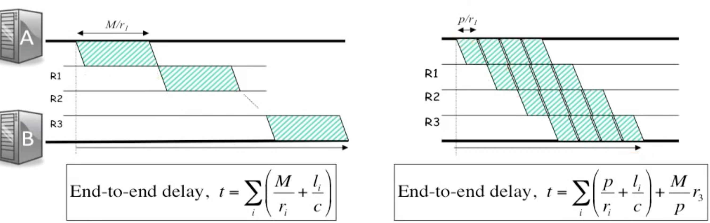

# 第三章
## 3-2 分组交换
* 将每个数据块打成一个包，并将其发送到路由器中，每个数据包都是自包含目的地信息，在路由器中根据路由匹配发送到下一个路由器，直到送到目的地。
* 分组交换会把接收到的数据暂时放在缓冲区中。

## 3-3 分组交换  端到端延时
* 传播延时
    * 在链路上一个比特传送到目的地需要的时间， $t1 = length/c$ （length：物理距离， c：接近光速）
* 打包延时
    * 从第一个到最后一个比特从主机送到链路上所需要的时间， $tp = packect size/ r$（r： bit/s 每秒能处理比特的速度）
* 排队延时
    * 分组交换机会转发任何数据包具有公用的性质，会把收到的数据放到缓冲区中。在缓冲区的等待的时间为排队延时。

* 端到端延时为上述延时的总和。
    * 


## 3-4 分组交换 play-back

## 3-5 分组交换 队列模型
* 队列模型
    * 入队的速度= 接收数据的速度-转出数据的速度
    
* 小的包更有利于降低端到端延时
    * 
 
* 统计多路复用 （GPT的回答）
    * 统计多路复用（Statistical Multiplexing）是一种在共享通信媒介（如网络或电缆）上实现多个信号共存的技术。这种技术通过动态分配带宽，以适应不同信号的传输需求，从而提高通信媒介的利用率和传输效率。

    * 在统计多路复用中，不同信号的带宽需求是随机的，因此在某些时刻，有些信号可能需要较大的带宽，而在其他时刻则可能需要较小的带宽。通过对信号的带宽需求进行统计分析，系统可以在不影响信号传输质量的前提下，动态分配带宽，使得所有信号都能够得到满足。这种技术在现代的通信系统中得到广泛应用，例如在互联网传输、无线通信、数字电视等领域。


## 3-6 队列模型示例 缓冲队列的性质
* 突发的流量会增加延迟
    * 因为流量突发，交换机中的缓冲区中在一定间隔时间内都是处于有数据的状态，因此新来的流量需要等待。

* determinism minimized delay   
    * 随机到达的平均等待长于简单规律的到达。

* Little result
    * 如图 $lambda$为平均到达速率，$d$为平均延迟 ， $L$为缓冲队列的平均大小
    * 

    * 珀松过程 ？

* M/M/1 queue
    

## 3- 7 分组交换工作
* 通用的交换剂大致使用三个步骤进行分组交换
* 步骤
    * 寻找地址 
        * 在以太网交换机中需要地址的绝对匹配时认为找到了地址
        * 在路由器中使用IP地址的**最长前缀匹配**的方式寻找匹配项
    * 更新头
        * 在路由器中检查CheckSum，更新TTL后重新计算CheckSum后写入到头
    * 包入队
        * 将包放入到匹配了的链路端口队列中

* 以太网交换机的具体流程
    * 检查每个到达的桢的头
    * 如果以太网的目的地址在转发表中存在，转发桢到整蛊饿的输出端口中
    * 如果以太网的目的地地址不在转发表中，广播桢到所有端口（除了发送桢的端口）
    * 该表中的条目是通过检查到达报文的以太网源地址来学习的

* 路由机转发流程
    * 如果到达的以太网目的地桢属于路由器，则接收，否则丢弃
    * 检查IP的版本号，数据桢的长度
    * TTL减一，更新IP头的CHECKSUM
    * 如果TTL为0 则丢弃
    * 如果IP的目的地地址在转发表中，则转发到正确的吓一跳的端口
    * 找到下一跳路由的以太网目的地址
    * 创建新的以太网帧并且发送

* 最长前缀匹配
    * 

## 3-8 


## 3-9 速率保证原则
* WFQ weight fair queue
* 实现
    * 流量分类：将网络中数据流按照传输的应用，来源，目的进行分类，并放入到相应的队列中
    * 权重计算：为每个流计算权重值，根据权重值能够计算出每个队列能够处理流量的速度。 $Rç = R * (Wç/Wå)$ （Wç：队列的权重， Wå： 所有队列权重和）
        * 在课程中权重是事先定义的
    * 队列管理：
        * 因为每个流量的大小已经确定，在每个队列中处理该流量的时间也能够被确定。
    * 时间片调度
        * 调度器每次轮训队列时找出需要使用的时间最少的流量进行发送。
    * 数据标记

* 逻辑视图
    * 
    ```
                +----+     +----+
        Flow 1-->| Q1 |--->-|    |
                +----+     |    |--->- Output
                +----+     | WFQ|
        Flow 2-->| Q2 |--->-|    |
                +----+     |    |--->- Output
                +----+     |    |
        Flow 3-->| Q3 |--->-|    |
                +----+     +----+

    ```

## 3-10 延迟保障
* 为了保障不丢包，在给定速率的情况下下面这个式子能说明如何实现。
    * A(t)（入队的速率）* t（时间）= B（交换剂队列缓冲区大小） + D（t）（出对的速率）* t（时间）