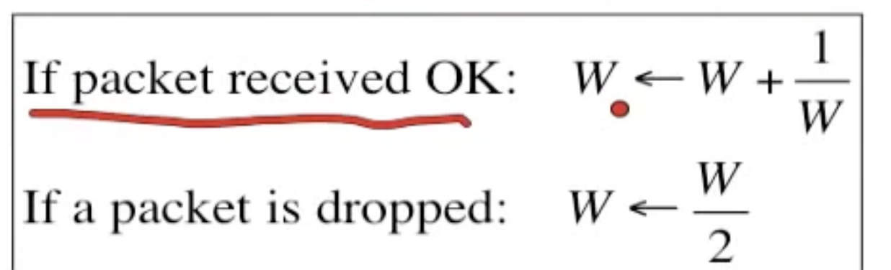
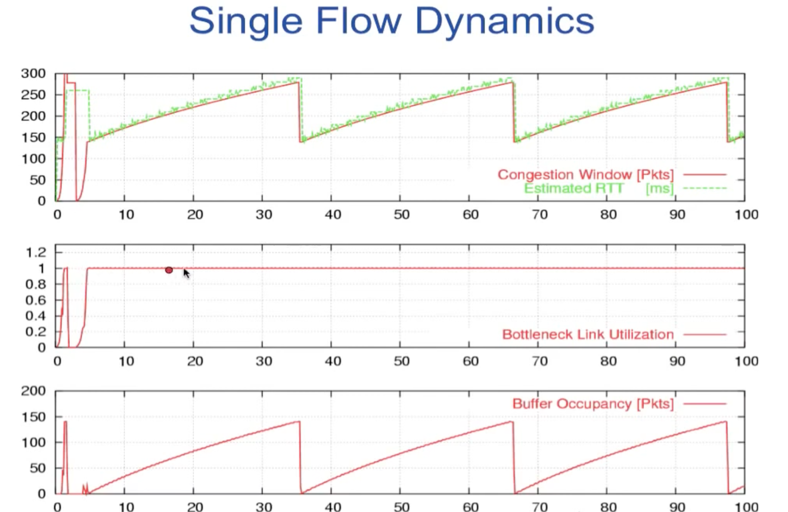
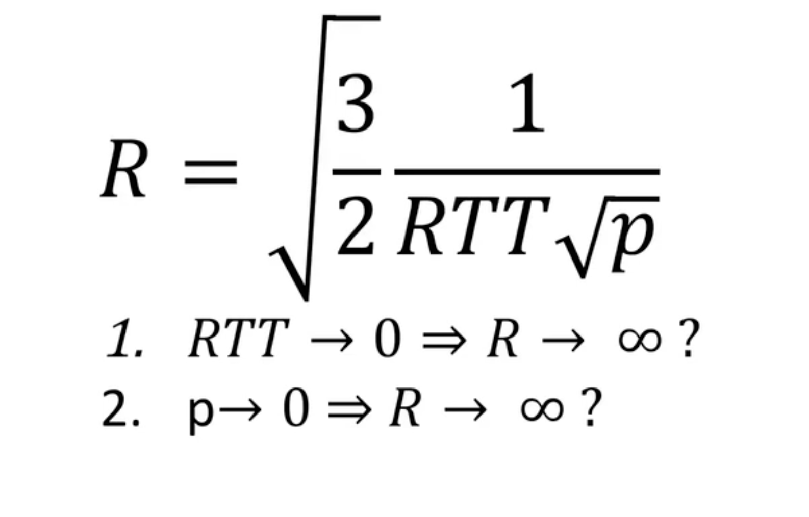
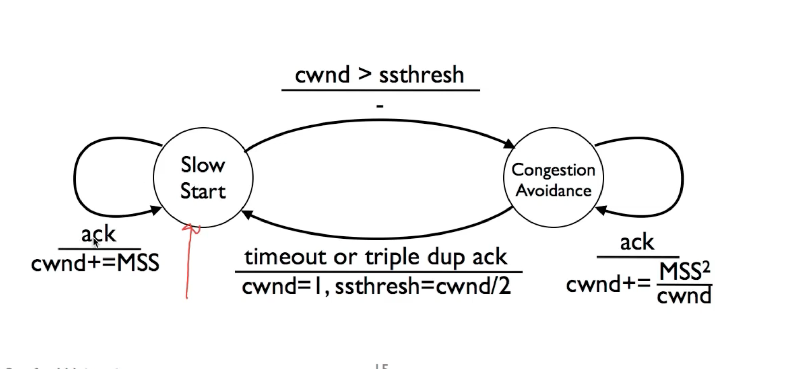
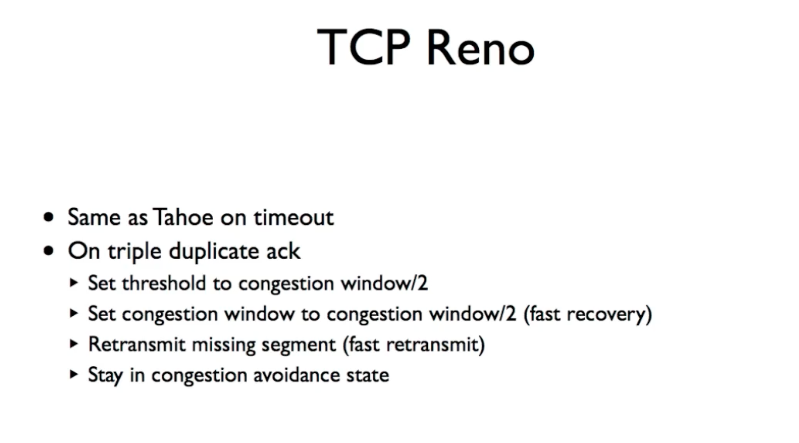
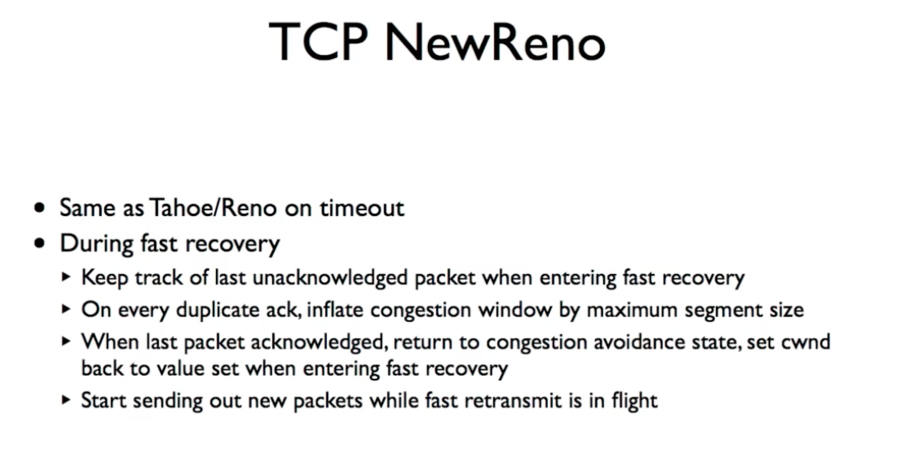

# 第四章
## 拥塞控制-基础知识
* max-min fair定义
    * 如果增加某一流的流量，但是前提是不降低最低流量来实现

## 拥塞控制的基本方法
* 在路由器中实现，该方法通过侦测丢弃的包，并且获取该头部的信息，如果有该包相关连的包经过该路由回送，则添加一些信息，表明包被丢弃。发送方收到包被丢弃的消息后调整发送速率。
    * 该方法实际中应用很少。
    
* 端到端实现
    * 发送方以（W+1/W）的速率逐包增加拥塞窗口的大小，在发送包后没有取得承认的消息，则将拥塞控制窗口降低位原值的一半，之后逐步增加1/W（窗口大小）
    * AIMD 
        * 
    * 窗口的大小 = min（窗口大小， 拥塞控制窗口大小）
    * 
    * 拥塞控制的动态图 (单个流)
        * 

## AIMD在多个流中的属性
* AIMD在多个流中的表现形式为，多个流会流入路由器，因此缓冲区很可能处于较满的情况，所以某个流的某个包将会被随机的丢弃。
* 因为缓冲区处于较满的状态，RTT（Round Trip Time）往返时间往往会是固定的时间。因此R（平均速率） = W （窗口大小）/RTT 的公式可知，平均速率应该窗口大小有正向关系
* 平均速率与丢包概率的关系 (仅仅用于说明，不能用于普遍情况)
    * 

## 拥塞控制 
* 慢启动 TCP taho的处理过程
    * 慢启动过程
        * 第一次发送一个MSS，当得到承认后发送两个MSS，以指数的形式增长到一个阈值
        * 当到达阈值后，转入到拥塞回避状态。
        
* 拥塞回避
    * 拥塞回避过程
        * 在该状态中，每次承认到达后只增加一个MSS大小的窗口。
        * 当遇到重复承认或者是重传发生时阈值设定为最大窗口的一半，并转移到慢启动状态。

* 状态图
    * 

* RTT估计
    * 过程
        * r时RTT的估计值，初始化为某个合理的值
        * g时EWNA的增益 0.25
        * m是最近承认数据的RTT的测量值
        * 偏差估计为 e = m-r
        * r = r + g dot e
        * 测量方法 v = v+g（|e| -v）
        * 超时 T = r+ß*v (ß = 4)
        * 指数增加超时
* 自计时
    * 只有数据离开时才放入数据
        * 为了防止拥塞
    * 作为承认的回应发送新数据
    * 快速的发送承认

* 拥塞控制的优化
    * TCP Reno
        * 
        * 超时时与tahoe行为相同，
        * 当收到重复的承认时行为有所不同
    
    * TCP NewReno
        * 
        * 