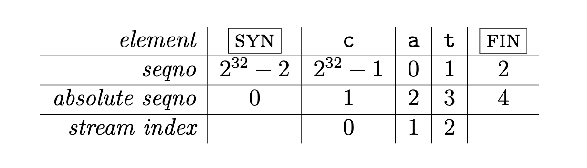

# 实验笔记
## https://cs144.github.io/assignments/lab2.pdf
## 代码风格
* 使用 Resource acquisition is initialization 风格，即 RAII 风格。

* 禁止使用 malloc 和 free 函数

* 禁止使用 new 和 delete 关键字

* 禁止使用原生指针（*）。若有必要，最好使用智能指针（unique_ptr等等）。

* CS144实验指导书说明，该实验没有必要用到指针。

* 禁止使用模板、线程相关、各类锁机制以及虚函数

* 禁止使用C风格字符串(char*) 以及 C 风格字符串处理函数。使用 string 来代替。

* 禁止使用 C 风格强制类型转换。若有必要请使用 static_cast

* 传递参数给函数时，请使用常量引用类型（const Ty& t）

* 尽可能将每个变量和函数方法都声明成 const

* 禁止使用全局变量，以及尽可能让每个变量的作用域最小

* 在完成代码后，务必使用 make format 来标准化代码风格

## lab0 warm up
* 
* webget
    * 建立tcp连接后发送HTTP的请求
    * 
    ```
    void get_URL(const string &host, const string &path) {
        // Your code here.

        // You will need to connect to the "http" service on
        // the computer whose name is in the "host" string,
        // then request the URL path given in the "path" string.
        const string HTTP = "http";
        const string HEAD_HTTP_VER = "HTTP/1.1\r\n";
        const string HEAD_GET = "GET " + path + " "  + HEAD_HTTP_VER ;
        const string HEAD_HOST = "Host: " + host + "\r\n";
        const string CONNECTION_CLOSE = "Connection: close\r\n";
        string response = "";
        TCPSocket tcpSocket ;
        tcpSocket.connect(Address(host, HTTP));

        size_t rsize = tcpSocket.write(HEAD_GET);
        if(rsize == 0)
            throw unix_error ("rsize == 0", 1);

        rsize = tcpSocket.write(HEAD_HOST);
        if(rsize == 0)
            throw unix_error ("rsize == 0", 1);

        rsize = tcpSocket.write(CONNECTION_CLOSE);
        if(rsize == 0)
            throw unix_error ("rsize == 0", 1);
        rsize = tcpSocket.write("\r\n");
        if(rsize == 0)
            throw unix_error ("rsize == 0", 1);

        string outputData ;
        while( !tcpSocket.eof() )
        {
            tcpSocket.read(response);
            outputData.append(response);
        }

        cout << outputData;
    }
    ```

* 4 in-memory reliable byte stream
* 生产者消费者模型的一种实现，不过不需要考虑多线程的情况。
* byte_stream.hh
    * 
    ```
        #ifndef SPONGE_LIBSPONGE_BYTE_STREAM_HH
        #define SPONGE_LIBSPONGE_BYTE_STREAM_HH

        #include <string>
        #include "util.hh"
        //#include <queue>
        #include <iostream>
        #include <cassert>


        //! \brief An in-order byte stream.

        //! Bytes are written on the "input" side and read from the "output"
        //! side.  The byte stream is finite: the writer can end the input,
        //! and then no more bytes can be written.
        class ByteStream {
        private:
            // Your code here -- add private members as necessary.

            // Hint: This doesn't need to be a sophisticated data structure at
            // all, but if any of your tests are taking longer than a second,
            // that's a sign that you probably want to keep exploring
            // different approaches.
            size_t _capacity = 0;       // 容量
            size_t _readIndex = 0;      // 读取的索引
            size_t _writeIndex = 0;     // 写入的索引
            std::string _data {};       // 数据存储
            bool _isEnded = false;
            bool _isEOF = false;
            size_t _writeBytesSize = 0;
            size_t _readBytesSize = 0;
            size_t _bufSize = 0;        // 缓冲区大小

            bool _error{};  //!< Flag indicating that the stream suffered an error.

        public:
            //! Construct a stream with room for `capacity` bytes.
            ByteStream(const size_t capacity);

            //! \name "Input" interface for the writer
            //!@{

            //! Write a string of bytes into the stream. Write as many
            //! as will fit, and return how many were written.
            //! \returns the number of bytes accepted into the stream
            size_t write(const std::string &data);

            //! \returns the number of additional bytes that the stream has space for
            size_t remaining_capacity() const;

            //! Signal that the byte stream has reached its ending
            void end_input();

            //! Indicate that the stream suffered an error.
            void set_error() { _error = true; }
            //!@}

            //! \name "Output" interface for the reader
            //!@{

            //! Peek at next "len" bytes of the stream
            //! \returns a string
            std::string peek_output(const size_t len) const;

            //! Remove bytes from the buffer
            void pop_output(const size_t len);

            //! Read (i.e., copy and then pop) the next "len" bytes of the stream
            //! \returns a string
            std::string read(const size_t len);

            //! \returns `true` if the stream input has ended
            bool input_ended() const;

            //! \returns `true` if the stream has suffered an error
            bool error() const { return _error; }

            //! \returns the maximum amount that can currently be read from the stream
            size_t buffer_size() const;

            //! \returns `true` if the buffer is empty
            bool buffer_empty() const;

            //! \returns `true` if the output has reached the ending
            bool eof() const;
            //!@}

            //! \name General accounting
            //!@{

            //! Total number of bytes written
            size_t bytes_written() const;

            //! Total number of bytes popped
            size_t bytes_read() const;
            //!@}
        };

        #endif  // SPONGE_LIBSPONGE_BYTE_STREAM_HH
    ```

* byte_stream.cc
    * 
    ```
    #include "byte_stream.hh"

    // Dummy implementation of a flow-controlled in-memory byte stream.

    // For Lab 0, please replace with a real implementation that passes the
    // automated checks run by `make check_lab0`.

    // You will need to add private members to the class declaration in `byte_stream.hh`

    template <typename... Targs>
    void DUMMY_CODE(Targs &&... /* unused */) {}

    using namespace std;

    ByteStream::ByteStream(const size_t capacity) {
        // initialize datastruct
        _capacity = capacity;
        _data =  string(capacity, ' ') ;
    }

    size_t ByteStream::write(const string &data) {

        // check remain length if  <  data len error
        size_t len = data.length();
        if (len > remaining_capacity() ) {
            len = remaining_capacity();
        }

        for (size_t i = 0;  i < len ; i++) {
            _data[(_writeIndex++) %_capacity] = data.at(i);
        }

        _writeIndex = _writeIndex %_capacity;
        _writeBytesSize = _writeBytesSize +len;
        _bufSize+=len;
        return len;
    }

    //! \param[in] len bytes will be copied from the output side of the buffer
    string ByteStream::peek_output(const size_t len) const {

        if (len > (_capacity-remaining_capacity())) throw unix_error("peek data len is too big");
        string result;
        for(size_t i = 0; i < len; i++)
        {
            result.push_back( _data.at((_readIndex+i) %_capacity));
        }
        return result;
    }

    //! \param[in] len bytes will be removed from the output side of the buffer
    void ByteStream::pop_output(const size_t len) {

        if (len > buffer_size()) throw unix_error("pop data len > buffer size");
        _readIndex = (_readIndex + len) % _capacity;
        _readBytesSize = _readBytesSize +len;
        _bufSize-=len;
    }

    //! Read (i.e., copy and then pop) the next "len" bytes of the stream
    //! \param[in] len bytes will be popped and returned
    //! \returns a string
    std::string ByteStream::read(const size_t len) {
        // check
        if (len > buffer_size()) throw unix_error("peek data len > buffer size");

        string result;
        for(size_t i = 0; i < len; i++)
        {
            result.push_back( _data.at((_readIndex++) % _capacity));
        }
        _readIndex = _readIndex %_capacity;
        _readBytesSize = _readBytesSize +len;
        _bufSize -= len;

        return result;
    }

    void ByteStream::end_input() {
        _isEnded = true;
    }

    bool ByteStream::input_ended() const { return _isEnded; }

    size_t ByteStream::buffer_size() const {

        return _bufSize;
    }

    bool ByteStream::buffer_empty() const { return _bufSize == 0; }

    bool ByteStream::eof() const {

        return buffer_empty() && input_ended();
    }

    size_t ByteStream::bytes_written() const { return _writeBytesSize; }

    size_t ByteStream::bytes_read() const { return _readBytesSize; }

    size_t ByteStream::remaining_capacity() const {

        return _capacity - buffer_size();
    }

    ```


## lab1 
* 
* 实现流的组装实现
    * 实现思路
        * 将字节流写入的第一个索引为排序字段加入到优先队列中。
        * 当预期索引与优先队列中顶部的索引匹配时循环遍历优先队列，直到预期索引与顶部索引不再匹配（匹配是指预期大于顶部）
        * 需要计算有效载荷- 因为字节流是无序且字节流可能存在重复的可能。因此将每个map中的字节流（每次写入操作都会将字节写入到map中（排序的））遍历一次，并计算字节的有效载荷

    * stream_reassembler.hh
    ```
         struct Segment{

            uint64_t  _index;           //
            std::string  _data;
            bool _eof;
            size_t _payLoadSize ;

            Segment(uint64_t index,const std::string & data, bool eof, size_t payLoadSize) : _index(index) ,_data( data),
                _eof(eof) , _payLoadSize(payLoadSize){};
            friend  bool operator< (Segment const & left, Segment const & right)
            {
                return left._index > right._index;
            };
        };

        class StreamReassembler{

        private:
            // Your code here -- add private members as necessary.

            ByteStream _output;  //!< The reassembled in-order byte stream
            size_t _capacity;    //!< The maximum number of bytes
            //using Segment = std::pair<uint64_t , std::reference_wrapper<const std::string>>;
            //auto cmp = [](Segment left, Segment right){ return left.first < right.first;};
            std::priority_queue<Segment> _unAssembledSegments{};
            size_t _expectedIndex = 0;
            size_t _unAssembledByteSize = 0;
            std::map<size_t , size_t > _unAssemblePayloads{};
            // !  using unAssemble payload map to calculate new seg`s payload size
            void calculatePayload(size_t index ,  size_t size, size_t & payload);
            ......
    ```
    
    *  stream_reassembler.cc
    ```
        #include "stream_reassembler.hh"

        // Dummy implementation of a stream reassembler.

        // For Lab 1, please replace with a real implementation that passes the
        // automated checks run by `make check_lab1`.

        // You will need to add private members to the class declaration in `stream_reassembler.hh`

        template <typename... Targs>
        void DUMMY_CODE(Targs &&... /* unused */) {}

        using namespace std;


        StreamReassembler::StreamReassembler(const size_t capacity) : _output(capacity), _capacity(capacity) {
        }

        void StreamReassembler::calculatePayload(size_t index,size_t  size, size_t &payload) {

            payload = size ;
            size_t left = 0;
            size_t right = 0;
            for(auto iter = _unAssemblePayloads.begin(); iter != _unAssemblePayloads.end(); iter++)
            {
                // ---111-----1111
                //     i        s
                left = max(index, iter->first);
                right = min((index+size), (iter->first+iter->second));
                if(left < right)
                    payload-=(right-left);
            }
        }


        //! \details This function accepts a substring (aka a segment) of bytes,
        //! possibly out-of-order, from the logical stream, and assembles any newly
        //! contiguous substrings and writes them into the output stream in order.
        void StreamReassembler::push_substring(const string &data, const size_t index, const bool eof) {


            // 如果新数据已被组装，则返回
            if (_expectedIndex > (index + data.size()))
                return;
            // 有效载荷
            size_t payLoadSize =0;
            // 计算有效载荷 通过循环map来找到要插入数据的有效载荷
            calculatePayload(index, data.size(), payLoadSize);
            _unAssembledByteSize+= payLoadSize;

            // 将数据插入到以index为排序的优先队列中
            Segment seg (index, data, eof,payLoadSize);
            _unAssembledSegments.push(seg);
            Segment toAssembleSeg =  _unAssembledSegments.top() ;

            // 将数据插入到map中
            auto iter = _unAssemblePayloads.find(index);
            if( (iter != _unAssemblePayloads.end() && iter->second < data.size()) ||
                iter == _unAssemblePayloads.end())
            {
                _unAssemblePayloads.insert_or_assign(index, data.size());
            }

            // 循环便利优先队列
            while(_expectedIndex >= toAssembleSeg._index
                && !_unAssembledSegments.empty())
            {
                // 如果是已被组装了的数据， 则忽略
                if (_expectedIndex > (toAssembleSeg._index + toAssembleSeg._data.size()))
                {
                    _unAssemblePayloads.erase(toAssembleSeg._index);
                    _unAssembledByteSize -= toAssembleSeg._payLoadSize;
                    _unAssembledSegments.pop() ;
                    toAssembleSeg =  _unAssembledSegments.top() ;
                    continue ;
                }

                // 写入到字节流中的正确的位置
                uint64_t pos = _expectedIndex-toAssembleSeg._index;
                _output.write(toAssembleSeg._data.substr(pos));
                // 更新预期字符串的索引
                _expectedIndex = _output.bytes_written();
                // 更新未被组装的报文的字节数
                _unAssembledByteSize -= toAssembleSeg._payLoadSize;

                // 如果是EOF且已写入的字节的字节为最后一个时 指定写入结束
                if( toAssembleSeg._eof && _output.bytes_written() == (toAssembleSeg._index+toAssembleSeg._data.size() )) _output.end_input();

                //map更新
                _unAssemblePayloads.erase(toAssembleSeg._index);
                // 优先队列中删除第一项
                _unAssembledSegments.pop() ;
                toAssembleSeg =  _unAssembledSegments.top() ;

            }
        }

        size_t StreamReassembler::unassembled_bytes() const { return _unAssembledByteSize; }

        bool StreamReassembler::empty() const { return _unAssembledByteSize == 0; }


    ```


## 实验2 笔记 TCP的接收
* 需要将32位的sequence转化为64位的绝对sequence
* 
* 32位转64位时需要根据checkpoint（最近承认的绝对sequence的值）与转化到临时的64位sequence的距离进行比较，找到与checkpoint最近的序列，该序列位64位的序列
*  wrapping_integers.cc
```
    #include "wrapping_integers.hh"

    // Dummy implementation of a 32-bit wrapping integer

    // For Lab 2, please replace with a real implementation that passes the
    // automated checks run by `make check_lab2`.

    template <typename... Targs>
    void DUMMY_CODE(Targs &&... /* unused */) {}

    using namespace std;

    //! Transform an "absolute" 64-bit sequence number (zero-indexed) into a WrappingInt32
    //! \param n The input absolute 64-bit sequence number
    //! \param isn The initial sequence number
    WrappingInt32 wrap(uint64_t n, WrappingInt32 isn) {
        uint64_t seq = (n + isn.raw_value() ) % (static_cast<uint64_t>(UINT32_MAX)+1);

        return WrappingInt32(static_cast<uint32_t>(seq));
    }

    //! Transform a WrappingInt32 into an "absolute" 64-bit sequence number (zero-indexed)
    //! \param n The relative sequence number
    //! \param isn The initial sequence number
    //! \param checkpoint A recent absolute 64-bit sequence number
    //! \returns the 64-bit sequence number that wraps to `n` and is closest to `checkpoint`
    //!
    //! \note Each of the two streams of the TCP connection has its own ISN. One stream
    //! runs from the local TCPSender to the remote TCPReceiver and has one ISN,
    //! and the other stream runs from the remote TCPSender to the local TCPReceiver and
    //! has a different ISN.
    uint64_t unwrap(WrappingInt32 n, WrappingInt32 isn, uint64_t checkpoint) {

        uint32_t offset = n.raw_value() - wrap(checkpoint, isn).raw_value();
        uint64_t result = checkpoint + offset;
        /*如果新位置距离checkpoint的偏移offset大于1<<32的一半也就是1<<31,
        那么离checkpoint最近的应该是checkpoint前面的元素
        举个例子: 1---------7(checkpoint)----------------1<<32+1;
        由于是无符号数相减所以1-7 == 1<<32+1 - 7;
        所以应该是1距离7最近所以应该选1
        */
        if (offset > (1u << 31) && result >= (1ul << 32))
            result -= (1ul << 32);
        return result;
    }

```

* segment_receive函数根据头字段中syn和fin的状态，各自执行相应的处理
* tcp.receiver.hh
```

    #define EOF_IS_TRUE true
    //! \brief The "receiver" part of a TCP implementation.

    //! Receives and reassembles segments into a ByteStream, and computes
    //! the acknowledgment number and window size to advertise back to the
    //! remote TCPSender.
    class TCPReceiver {
        //! Our data structure for re-assembling bytes.
        StreamReassembler _reassembler;

        //! The maximum number of bytes we'll store.
        size_t _capacity;
        bool _synFlag = false;              // syn flag
        bool _finFlag = false;              // fin flag

        WrappingInt32 _isn{0};          // syn sequence no
        WrappingInt32 _finSeq{0};       // fin se

        uint64_t _ackNo = 0;             // ack no;
        uint64_t _lastReceviedSequence = 0 ; // 取得最大的最后一个序列

    ....

    }
```

* tcp_receiver.cc
```
    #include "tcp_receiver.hh"

    // Dummy implementation of a TCP receiver

    // For Lab 2, please replace with a real implementation that passes the
    // automated checks run by `make check_lab2`.

    template <typename... Targs>
    void DUMMY_CODE(Targs &&... /* unused */) {}

    using namespace std;

    void TCPReceiver::segment_received(const TCPSegment &seg) {
        TCPHeader header = seg.header();

        // syn segment
        if(header.syn )
        {
            _synFlag = true;
            _isn = header.seqno;
        }
        // fin segment
        if (header.fin ){
            _finFlag = true;
            _finSeq = header.seqno;
            // fin syn 同时到达时
            if (header.syn  ) {
                _synFlag = true;
                _isn = header.seqno;
                _finSeq = _finSeq+1;
            }

            // fin seq转换未ABS seq checkpoint的值为最后一个组装的字节数
            uint64_t finSeq = unwrap(_finSeq, _isn, _reassembler.stream_out().bytes_written()  );
            // 写入最后一个字符，并指定未EOF
            _reassembler.push_substring(seg.payload().copy(),finSeq-1,  EOF_IS_TRUE);
            // 因为接收到了fin，ackNo需要占用一个位置，+1 且从流的索引转换到绝对的序列号时也需要+1

            _ackNo = _reassembler.stream_out().bytes_written()+1;
            if(_reassembler.stream_out().input_ended())
                _ackNo++;

        }
        // 已经建立连接的前提下
        else if(_synFlag)
        {

            uint64_t absSeq = unwrap(header.seqno, _isn, _reassembler.stream_out().bytes_written() );
            // 写入StreamReAssembler中
            Buffer payload = seg.payload();
            // 如果时syn和数据一起收到时数据的index需要加1
            if(absSeq == 0 && header.syn )
                absSeq++;

            _reassembler.push_substring(payload.copy(), absSeq-1, !EOF_IS_TRUE);
            _ackNo = _reassembler.stream_out().bytes_written()+1;
            // 输入结束时ack需要加1
            if(_reassembler.stream_out().input_ended())
                _ackNo++;
        }
    }

    optional<WrappingInt32> TCPReceiver::ackno() const {

        // 还没收到syn 则返回空
        if (_synFlag == false){
            return std::optional<WrappingInt32> ();
        }
        //
        WrappingInt32 ackNo = wrap(_ackNo, _isn);
        return optional<WrappingInt32>(ackNo);

    }

    size_t TCPReceiver::window_size() const {
        uint64_t remainingCap = _reassembler.stream_out().remaining_capacity();
        //uint64_t unAssembleSize = _reassembler.unassembled_bytes();wsat
        return remainingCap ;
    }

```

## lab4 TCPConnection
* 该实验比较复杂，需压想清楚TCP的状态变化。
* 同时，要确保前几个实验的代码需要好的实现，要不然会在该实验中出现问题。
* 实验代码
    *  [TCPConnection.cc](https://github.com/unbong/cs144/blob/master/libsponge/tcp_connection.cc)
    * [TCPConnection.h](https://github.com/unbong/cs144/blob/master/libsponge/tcp_receiver.hh)

## lab5 APR
* arp包中设置的内容（以以太网为例）
    * ehter_type: ADDRESS_RESOLUTION
    * hrd: Ethernet
    * pro: 需要被解决的协议类型
    * hln: 6
    * pln: 4
    * op: REQUEST
    * sha: 源的48位mac地址
    * tpa: 目标的协议地址 即 目标ip地址
    * spa: 源ip地址
    * pha: 广播地址（所有位设定1）

* 实验代码

    * [network_interface.cc](https://github.com/unbong/cs144/blob/master/libsponge/network_interface.cc) 
    * [network_interface.h](https://github.com/unbong/cs144/blob/master/libsponge/network_interface.hh)  

## lab6 route
* 实验需要完成路由匹配的代码，比较简单。需要改进的地方是最长前缀匹配的部分可以优化一下，目前想到的方案为最长前缀匹配树来实现。
* 实验代码
    * [router.cc](https://github.com/unbong/cs144/blob/master/libsponge/router.cc)
    * [router.hh](https://github.com/unbong/cs144/blob/master/libsponge/router.hh)
